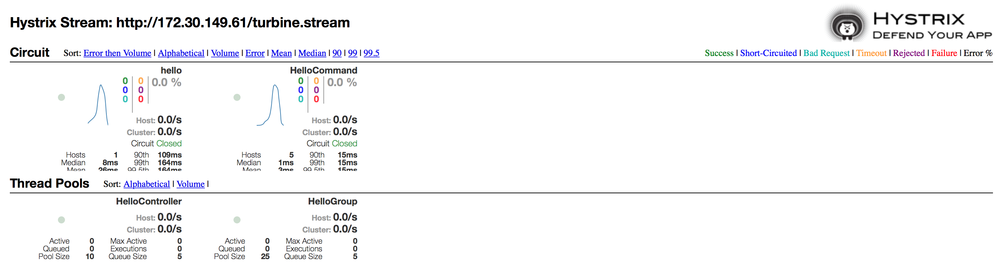

Migrating SpringBoot to OpenShift Enterprise 3.1: Hystrix Example
------------------------------

This is a SpringBoot Hello World example demonstrating connectivity to a Hystrix / Turbine Stream (Netflix OSS) running on OpenShift Enterprise 3.1

Instructions
------------

To build to the project:

    mvn clean package docker:build   
        
### Testing the Hello Hystrix example in Docker
To test the a hystrix example on Docker only, run:

     mvn clean package docker:build
     docker run -p 8080:8080 -t fusesource/docker-to-ose-hystrix
     
This example is a simple hello world servlet, that inserts a name taken from a parameter set in the URI.

You can access the servlet at: http://localhost:8080/?name=YourNameHere

After you've finished running the docker example, be sure to tidy up:

     docker ps (to obtain the container ID)
     docker stop <container ID>
     docker rm <container ID>

### Testing the Hello Hystrix example in OpenShift Enterprise 3.1:

To deploy the Hello Hystrix example to OpenShift, run:

     oc create -f scripts/sa.json
     oc policy add-role-to-group view system:serviceaccounts -n demo
     oc policy add-role-to-group edit system:serviceaccounts -n demo
     
Once the ServiceAccount has been created and permissions assigned (using the above procedure), create the deployment config:

     oc create -f dc.json
     
While logged in as System:Admin on OpenShift, kick-off the build:

     oc deploy spring-boot-hello-hystrix --latest

Now create the service and route:
	
	oc create -f service.json	
	oc expose service/hello-hystrix-service --hostname=hello-hystrix-service.cdk.vm.10.1.2.2.xip.io

You can access the servlet at: http://hello-hystrix-service.cdk.vm.10.1.2.2.xip.io/?name=<insert name>

### Using the Turbine Server and Hystrix Dashboard

To display the Hystrix metrics, follow the instructions to install the turbine-server and hystrix-dashboard described [here](https://github.com/sigreen/kubeflix).  Make sure you execute the following commands prior to running the maven commands:

	oc create -f scripts/sa.json
	oc policy add-role-to-group view system:serviceaccounts -n demo
	oc policy add-role-to-group edit system:serviceaccounts -n demo
	
To deploy the Turbine Service / Hystrix Dashboard to a remote running instance of OpenShift (assuming you have cloned the [kubeflix](https://github.com/sigreen/kubeflix) repo, execute the following:

	cd turbine-service
    mvn -Pf8-deploy -Ddocker.registry=<oseDockerHost>:<oseDockerPort> -Ddocker.username=$(oc whoami) -Ddocker.password=$(oc whoami -t)
    cd ../hystrix-dashboard
    mvn -Pf8-deploy -Ddocker.registry=<oseDockerHost>:<oseDockerPort> -Ddocker.username=$(oc whoami) -Ddocker.password=$(oc whoami -t)

 

 
